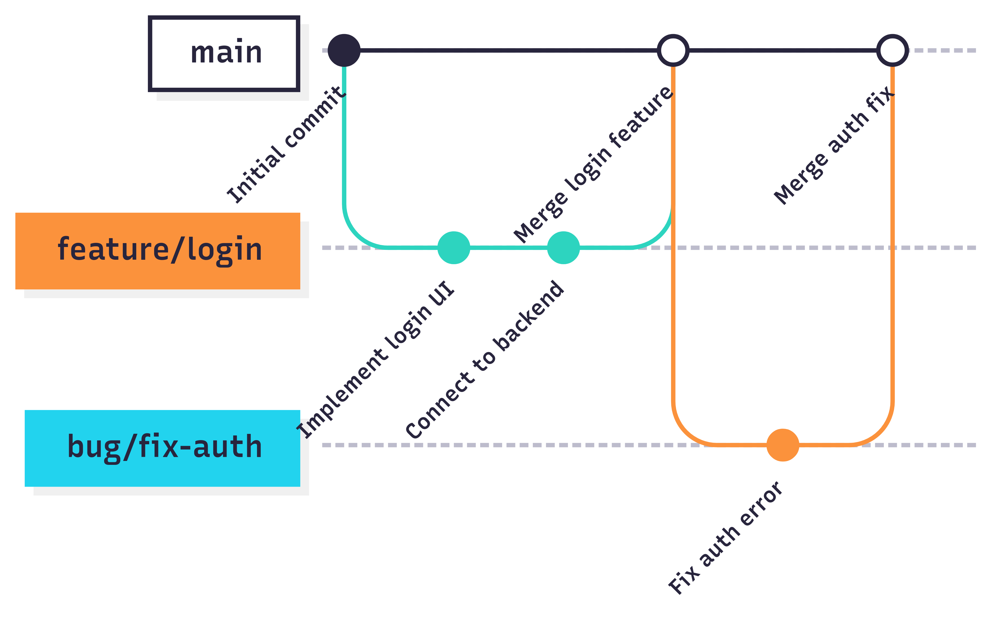

# Online store consultant

## Add your files

- [ ] [Create](https://docs.gitlab.com/ee/user/project/repository/web_editor.html#create-a-file) or [upload](https://docs.gitlab.com/ee/user/project/repository/web_editor.html#upload-a-file) files
- [ ] [Add files using the command line](https://docs.gitlab.com/topics/git/add_files/#add-files-to-a-git-repository) or push an existing Git repository with the following command:

```
cd existing_repo
git remote add origin https://gitlab.pg.innopolis.university/r.muliukin/online-store-consultant.git
git branch -M main
git push -uf origin main
```

## Integrate with your tools

- [ ] [Set up project integrations](https://gitlab.pg.innopolis.university/r.muliukin/online-store-consultant/-/settings/integrations)

## Collaborate with your team

- [ ] [Invite team members and collaborators](https://docs.gitlab.com/ee/user/project/members/)
- [ ] [Create a new merge request](https://docs.gitlab.com/ee/user/project/merge_requests/creating_merge_requests.html)
- [ ] [Automatically close issues from merge requests](https://docs.gitlab.com/ee/user/project/issues/managing_issues.html#closing-issues-automatically)
- [ ] [Enable merge request approvals](https://docs.gitlab.com/ee/user/project/merge_requests/approvals/)
- [ ] [Set auto-merge](https://docs.gitlab.com/user/project/merge_requests/auto_merge/)

## Test and Deploy

Use the built-in continuous integration in GitLab.

- [ ] [Get started with GitLab CI/CD](https://docs.gitlab.com/ee/ci/quick_start/)
- [ ] [Analyze your code for known vulnerabilities with Static Application Security Testing (SAST)](https://docs.gitlab.com/ee/user/application_security/sast/)
- [ ] [Deploy to Kubernetes, Amazon EC2, or Amazon ECS using Auto Deploy](https://docs.gitlab.com/ee/topics/autodevops/requirements.html)
- [ ] [Use pull-based deployments for improved Kubernetes management](https://docs.gitlab.com/ee/user/clusters/agent/)
- [ ] [Set up protected environments](https://docs.gitlab.com/ee/ci/environments/protected_environments.html)

***


## Name
Online store consulant.

## Description
Our project provides the best solution to the pain point of online consultantations in the shops. Our team offers the chat-bot that acts as a professional, answers in a simple user-friendly language without complex terms, remembers the shop stock, recall the dialogue history, and even communicates in a way that is indistinguishable from a human.


### Background

Initially, the consultants that worked locally at a specific shop had to answer to both online and offline clients. As a result, the waiting time increased dramitically while the response quality decreased accordingly.

### Features
```
* The consultant will only answer questions about the products or direct the client to those topics.
* The possibility of applying filters.
* The service works without using a VPN.
* The possibility of calling a human consultant.
* Support for additional functionality for registered users.
* Service analytics (processing speed, quality of service).
```

## Development
Our policies:
```
* We used the Trunk-based development with short-lived branches attached to a specific issue.
* At least one team member must have provided the useful feedback regarding the MR.
* The QA was performed via pipelining each time the changes in the codebase were introduced.
```

### Kanban board
The link to our Kanban board:
https://gitlab.pg.innopolis.university/r.muliukin/online-store-consultant/-/boards

#### Columns
There are entry criteria for each column. An issue can be closed when it reaches the ```Done``` column.

#### To Do
```
[Entry Criteria]
* The issue is unambigiously formulated as the issue form template.
* The issue is unanimously estimated in story points by all team members.
* The label is attached to the issue.
* The issue is desided to be in the sprints.
```

#### In Progress
```
[Entry Criteria]
* The issue description was revised to provide missing details.
* The issue was added to the current sprint.
```

#### Ready to Deploy
```
[Entry criteria]
* The MR attached to the issues passes the pipeline stage.
* The MR is approaved by at least one team member.
* All acceptance criterias are satisfied.
* All issues on which it depends are done.
```

#### Closed/Done
```
[Entry criteria]
* Also the previous development stages are passed.
* The code is merged into the main branch.
```

### **Git workflow**

---

#### Issue Management

- **Creating Issues**  
  Use our predefined issue templates when creating a new issue:
    - [Bug Report Template](./ISSUE_TEMPLATE/bug_report.md)
    - [Feature Request Template](./ISSUE_TEMPLATE/feature_request.md)
    - [Task Template](./ISSUE_TEMPLATE/task.md)

- **Labelling Issues**  
  Use consistent labels to categorize issues:
    - `bug`, `feature`, `task`, `enhancement`
    - `priority: high`, `priority: medium`, `priority: low`
    - `status: in progress`, `status: blocked`, `status: ready for review`

- **Assigning Issues**  
  Team members self-assign issues or are assigned by the project lead. Each issue should have at least one assignee responsible for completion.


#### **Branching Rules**
- **`main` branch**: Protected, used only for stable releases.
- **Feature branches**: Created from `main` for each task using the naming convention:
  feature/ISSUE_ID-short-description
#### **Commit Message Format**
- Follow **Conventional Commits**: type(issue-id): description
  **Types:**
    - `feat`: New feature
    - `fix`: Bug fix
    - `docs`: Documentation changes
    - `refactor`: Code improvements (no new features)
    - `test`: Test-related changes
#### **Merge Request (MR) Process**
- When a task is ready, create an MR from the feature branch to `main`.
- **MR Title Format:** type(#issue-id): short-description
  **Types:**
    - `feature`: New features or user-facing functionality.
    - `bugfix`: Bug fixes or critical patches.
    - `documentation`: Documentation updates (READMEs, comments, wikis).
    - `refactor`: Code improvements (non-breaking, no new features).
    - `testing`: Test additions/improvements (unit, integration, e2e)
      **MR Description Template:**
      Description  
      [Briefly describe changes]

  Changes  
  [List key changes]

  Testing Steps  
  [How to test the changes]

  Closes issue-id

#### **Code Review Rules**
- **Minimum 1 reviewer** required before merging.
- Reviewers should:
    - Check for code quality, logic errors, and edge cases.
    - Leave **constructive comments** (e.g., _"Add error handling for empty input in line 45"_).
    - The author updates the branch if changes are requested.
    - MR is merged only after:
    - All comments are resolved.
    - CI/CD pipelines pass (if configured).

#### Gitgraph Diagram


---

### Secret management
We thoroughly look after our secret data such as telegram bot token and DeepSeek API key. We prioriotize the safety in our project, that's why we use .env file to keep all these data. The bot token and DeepSeek API is shared only with the team members in Telegram PM. The data sharing happens iff the keeper of this secret data is sure that he/she is not being contacted by a fraudster.

## Badges
On some READMEs, you may see small images that convey metadata, such as whether or not all the tests are passing for the project. You can use Shields to add some to your README. Many services also have instructions for adding a badge.

## Visuals
Depending on what you are making, it can be a good idea to include screenshots or even a video (you'll frequently see GIFs rather than actual videos). Tools like ttygif can help, but check out Asciinema for a more sophisticated method.

## Installation
```

1) Clone the git repository into your IDE that supports Go programming language and docker deployment.
2) Create .env with two environment variables in the root of the project with the API_KEY and BOT_TOKEN fields.
3) Put in these fields valid DeepSeek API key retreived from https://platform.deepseek.com and bot token for your created bot via @BotFather in Telegram respectively.
4) Having installed Docker on your computer, run docker compose up --build in the IDE Terminal and enjoy the service running.
```

## Usage
To use our product you should:
```
* /start chat with our bot avalaible as @consultant_radad_bot in Telegram
* After that, you should follow the instructions that the bot asks you to do (language selection, registration, product selection, session starting)
* Finally, you can maintain the conversation with the consultant typing any messages you want or use any avalaible commands
Please Note:
* You can view list of all commands avalaible via Telegram widget "Menu"
```

## Support
In case of any misunderstanding and/or technical issues write in the PM to our developer using alias from /help command

## Roadmap
If you have ideas for releases in the future, it is a good idea to list them in the README.

## Contributing
State if you are open to contributions and what your requirements are for accepting them.

For people who want to make changes to your project, it's helpful to have some documentation on how to get started. Perhaps there is a script that they should run or some environment variables that they need to set. Make these steps explicit. These instructions could also be useful to your future self.

You can also document commands to lint the code or run tests. These steps help to ensure high code quality and reduce the likelihood that the changes inadvertently break something. Having instructions for running tests is especially helpful if it requires external setup, such as starting a Selenium server for testing in a browser.

## Authors and acknowledgment
Show your appreciation to those who have contributed to the project.

## License
For open source projects, say how it is licensed.

## Project status
If you have run out of energy or time for your project, put a note at the top of the README saying that development has slowed down or stopped completely. Someone may choose to fork your project or volunteer to step in as a maintainer or owner, allowing your project to keep going. You can also make an explicit request for maintainers.
